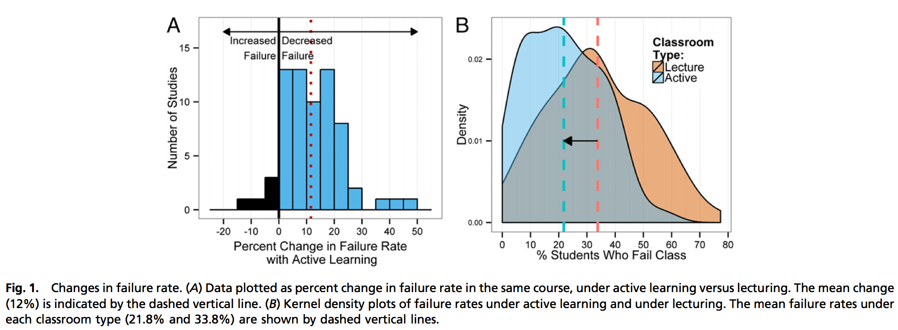

A new study came out in PNAS (Proceedings of the National Academy of Sciences) this week comparing _active_ instruction to traditional lecture instruction across STEM subjects.

The study can be found [here](http://www.pnas.org/content/early/2014/05/08/1319030111.full.pdf+html), and a friend of mine [Aatish Bhatia](https://twitter.com/aatishb) wrote a wonderful summary [here](http://www.wired.com/2014/05/empzeal-active-learning/).  I won't rehash Aatish's Wired article, but I do want to add a few thoughts and comments.

> To distinguish my own thoughts and **opinions** from more evidence-based claims I will indent them like this.

The study was a metaanalysis, which means it was a study of the results of other studies (225 in this case).  It looked at cases where a population of students was randomly grouped into one of two subpopulations.  One subpopulation received traditional lecture instruction, while the second subpopulation received at least some active instruction.

Metaanalysis is growing in popularity now that data is more widely available.  In theory it has a number of important benefits.  Combining studies means more data and more statistical power.  Additionally, combining studies by different people done under different conditions serves as some insurance against systematic errors.  On the flip-side, publication bias (or the tendency to report positive results and not negative ones) can be a serious problem for metaanalyses. More to come in a post on the topic.

It showed that failure rates--defined as D, F, or withdrawing--are 33% lower in classes with active instruction (21.8% vs 33.8%). (Image Credit: Freeman et al. PNAS.)

<figure>
	
	<figcaption></figcaption>
</figure>

> I was initially very skeptical of equating lower failure rates with more effective instruction.  One could imagine that active classes have a larger fraction of one's grade based on participation (more free points).  Fewer failures doesn't necessarily mean that more students have mastered the material.  However, this result does perhaps point to increased engagement.  Maybe active physics classes are more fun (and wouldn't that be great) and the decrease in failure rate is indicative of fewer totally disengaged students! 

To complement the lower failure rates, Freeman et al. also showed that students in the active instruction scored on average 6% higher on the same assessments than there lecture-only peers.  See panel A below. (Image Credit: Freeman et al. PNAS.)

<figure>
	
	<figcaption></figcaption>
</figure>

The x-axis on panel A above can be thought of as standard deviations.  Hedge's g is simply a way of standardizing effect size across studies.

> In their discussion, Freeman at al. noted that these score increases were even greater on concept inventories than they were on teacher written assessments.  To me this strengthens the case for active learning.  Concept inventories are tests carefully designed to address deep conceptual understanding.  They target misconceptions rather than skills. 

In their discussion, the authors note that the results are sufficiently striking, that were this a medical study, it would have been stopped and all patients would have been switched to active learning.  Additionally, they not that the increase in test scores is probably dampened by the lower withdrawal rate.

> I am very excited to see work like this in PNAS (which is a very good journal), and I hope, as the authors do, that this will shift the discussion from _is active learning better than traditional instruction?_ to _what forms of active learning are most effective?_  I would like to add another question for future thought and discussion. _How can we recruit teachers and schools around the country to help with this next problem?_  It will require much more data as there is no longer a well established control treatment.

### References

Freeman et al. [Active learning increases student performance in science, engineering, and mathematics.](http://www.pnas.org/content/early/2014/05/08/1319030111.full.pdf+html) PNAS.

Bhatia, Aatish. [Active Learning Leads to Higher Grades and Fewer Failing Students in Science, Math, and Engineering.](http://www.wired.com/2014/05/empzeal-active-learning/) WIRED.

